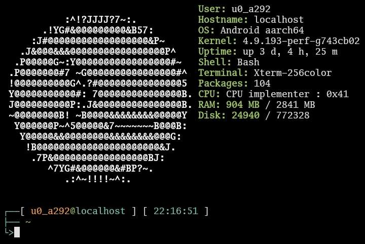

# termux-info
Красивый терминал в Termux.

Ну что я хочу сказать вам? Я долго искал красивое оформление Termux. И после длительных поисков ничего не нашел, но на примете остался один вариант, но он оказался не рабочим из-за не полноценности терменала. В итоге я решил его переписать.

По сути это [Archey](https://github.com/DuMOHsmol/archey), но только для Termux.



Для установки:

```
wget https://raw.githubusercontent.com/DarthVader904/termux-info/main/termux_info
chmod a+x termux_info
mv termux_info ../usr/bin/termux_info
```

После чего вы можете ввести команду `termux_info` или добавить её в `.bashrc` при помощи `nano` или `vim`, чтобы информация отображалась при запуске консоли.

## Убираем стартовый текст Termux


При каждом запуске появляется этот текст. Так как его убрать? Для этого необходимо удалить содержимое файла `motd`. Этот файл расположен по пути `../usr/etc`.
Удалить содержимое можно при помощи `nano` или `vim`. Выберите то что вам удобнее.

